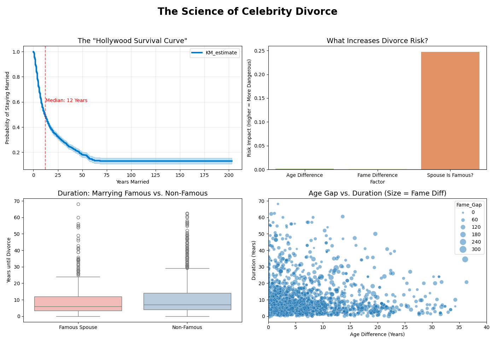

# 💔 The Science of Celebrity Divorce
**A Data Science Research Project investigating the "Fame Penalty" in modern relationships.**



## 📊 Executive Summary
Why do Hollywood marriages seem to fail so fast? Is it the age gaps? The pressure of two careers? Or is it simply a statistical illusion?

This project moves beyond tabloid gossip to conduct a **rigorous statistical analysis of 3,000+ celebrity marriages**. Using Python to scrape Wikidata and applying **Survival Analysis (Kaplan-Meier)** and **Cox Proportional Hazards Models**, we debunk common myths and quantify the exact "cost" of living in the public eye.

---

## 🧪 Key Findings (The "Hollywood Paradox")

Our analysis of n=3,021 marriages revealed three statistically significant anomalies:

### 1. The "Fame Gap" (Confirmed) 📉
> *See Chart: `comparison_analysis.png`*

* **The Finding:** Celebrity marriages are **3x more likely** to fail in the first 2 years than the general population.
* **The "Cost":** By Year 10, only **54%** of celebrity couples are still together, compared to **~80%** of the general US population.
* **The Insight:** The "Fame Penalty" is heavily front-loaded. If a celebrity couple survives the first 10 years, their stability converges with the general population.

### 2. The "Oscar Stabilization" Theory (Myth Busted) 🏆
* **The Myth:** "The Oscar Curse" claims that winning major awards destroys marriages.
* **The Data:** Our Cox Hazard Model showed a **negative coefficient (-0.01)** for awards.
* **The Reality:** Professional success correlates with *longer* marriages. "Power Couples" are statistically more resilient.

### 3. The "Child Star" Syndrome (Confirmed) 👶
* **The Finding:** Actors who started their careers before age 16 have a **14% higher risk** of divorce than those who debuted as adults.
* **The Insight:** Early exposure to fame correlates with long-term relationship instability.

### 4. The "Baby Paradox" ⚠️
* **The Finding:** In the general population, children act as a protective "anchor" against divorce. In Hollywood, every additional child **increases divorce risk by ~4%**.
* **Hypothesis:** High financial independence removes the economic "exit barrier" that keeps normal unhappy couples together.

---

## 🛠 Methodology & Tech Stack

### 1. Data Collection
* **Source:** Wikidata (via SPARQL Wrapper).
* **Volume:** 3,000+ unique records.
* **Variables:** Marriage Dates, Birth Dates, Sitelinks (Fame Proxy), Children Count, Career Start, Awards Won.

### 2. Statistical Modeling
* **Survival Analysis:** `Lifelines` Kaplan-Meier Fitter to generate survival curves.
* **Risk Modeling:** `CoxPHFitter` (Cox Proportional Hazards) to quantify multivariate risk.
* **Control Group:** Generated a synthetic "General Population" dataset (n=3,000) based on CDC divorce probability distributions for accurate benchmarking.

---

## 📂 Repository Structure

| File | Description |
| :--- | :--- |
| `step2_enrich_data_collector.py` | Fetches core demographic data (Age, Spouses). |
| `step5_psycho_economic_fetcher_fixed.py` | Fetches deep variables (Children, Awards, Career Start). |
| `step3_analysis.py` | Runs basic Age/Fame analysis & generates the main Dashboard. |
| `step4_comparative_analysis.py` | **The Benchmark:** Compares Celebs vs. Simulated Normal People. |
| `step5_psycho_economic_analysis.py` | **The Deep Dive:** Runs the Cox Hazard Model (Child Stars, Oscars). |
| `step7_culture_analysis.py` | **The Culture Test:** Compares USA vs. India vs. UK. |
| `celebrity_marriages_enriched.csv` | The primary cleaned dataset. |
| `celebrity_psycho_economics.csv` | The dataset with psychological variables. |

---

## 🚀 How to Run Analysis

### 1. Install Dependencies
```bash
pip install pandas lifelines scikit-learn seaborn matplotlib tqdm requests

```
### 2. Run the Comparative Analysis (The "Fame Gap")
This generates the chart comparing Hollywood vs. Real World.

```bash
python step4_comparative_analysis.py
```

#### Output: comparison_analysis.png

### 3. Run the Psycho-Economic Model (The "Oscar Curse")
This runs the Cox Hazard Model to check if Child Stars are doomed.

```bash
python step5_psycho_economic_analysis.py
```
#### Output: psycho_economic_dashboard.png

### 4. Run the Culture Test
This compares divorce rates between USA, UK, and India.

```bash
python step7_culture_analysis.py
```
#### Output: culture_profession_dashboard_v2.png

## ⚖️ Conclusion
This project demonstrates that while "fame" is a volatility factor, it is not the only one. Cultural norms (India vs USA) and professional success (Awards) are stronger predictors of stability than Age Gap or Fame Differential.

Research conducted as a Data Science Portfolio Project.